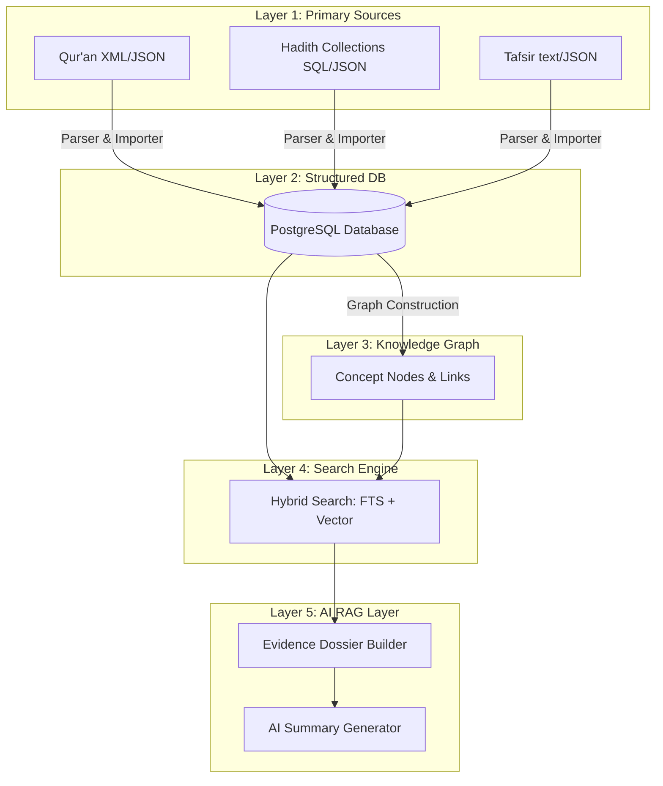

# Construction & Architecture Blueprint: Islamic Research Platform

This document serves as the master **Software Requirements Specification (SRS)** and **System Design Blueprint** for the Islamic Research Platform. It integrates the core vision, database schemas, multi-layered architecture, data import pipelines, and search/AI RAG workflows to guide development.

---

## 1. Product Vision & Core Principles

### 1.1 Vision
The **Islamic Research Platform** is a professional evidence-first research tool designed to mimic the workflow of modern legal research databases (e.g., LexisNexis or Westlaw). Instead of statutes and case law, its primary authorities are the **Qur'an**, **authentic Hadith collections**, and **classical Tafsir**. 

It is strictly **not** an "AI Mufti" that generates new religious rulings (fatwas). Rather, it is a tool to search, cross-reference, and summarize established primary texts.

### 1.2 Core Principles
1. **Quranic Supremacy**: The Qur'an is the foundational text and the highest level of authority. All other texts (Hadith, Tafsir) are mapped relative to it.
2. **Authenticity & Attribution**: Hadith collections must include complete metadata (narrator chains, collections, chapter, and grading where applicable). Tafsir must be attributed to specific classical scholars.
3. **Evidence-First AI**: The AI must not invent evidence, summarize unretrieved materials, or speak from its pre-trained memory. Every sentence in an AI summary must be traceably cited to a retrieved document.
4. **Reproducibility**: Querying the system must yield transparent, verifiable, and reproducible evidence dossiers. Users should be able to click on any claim and view the exact source text.

---

## 2. System Architecture: The 5-Layer Model

The platform operates across five logical layers, ensuring separation of static source text, index layers, relationship graphs, search infrastructure, and AI integration:



### 2.1 Layer 1: Primary Sources (The Constitution)
*   **Source Data**: Standardized machine-readable formats (JSON, XML, SQLite, SQL Dumps) rather than raw PDFs.
*   **Static Nature**: This data represents the core texts. Once imported and validated, it remains read-only to guarantee integrity.

### 2.2 Layer 2: Structured Database
*   **Objective**: Standardize text entries with detailed metadata fields.
*   **Database**: PostgreSQL is utilized for storing structured relational entities (Verses, Hadith, Tafsir, Topics) and handles vector storage via `pgvector` for semantic embeddings.

### 2.3 Layer 3: Knowledge Graph
*   **Objective**: Relate concepts and entities semantically to overcome keyword search limitations (e.g., mapping a query about "parents" to Arabic concepts like *Birr al-Walidayn* or verses about "mother" and "father").
*   **Entities**: `Topic`, `Verse`, `Hadith`, `Tafsir`, `Scholar`, `Narrator`.
*   **Relationships**: `explains`, `references`, `similar_to`, `about`, `narrated_by`.

### 2.4 Layer 4: Search Engine
*   **Objective**: Perform fast, multi-lingual, and concept-expanded searches.
*   **Execution**:
    1.  **Normalization & Cleanup**: Normalize Arabic diacritics (tashkeel), remove English/Urdu stop words.
    2.  **Concept Extraction**: Check queries against the Knowledge Graph to extract underlying concepts.
    3.  **Hybrid Search**: Combine PostgreSQL Full-Text Search (lexical matching) with vector similarity search (semantic matching) using dense embeddings.

### 2.5 Layer 5: AI RAG (Retrieval-Augmented Generation) Layer
*   **Objective**: Generate clear, cited syntheses of retrieved documents.
*   **Pipeline**:
    1.  User enters a query.
    2.  System retrieves relevant Verses, Hadiths, and Tafsir texts.
    3.  System ranks and packages these elements into an **Evidence Dossier**.
    4.  An LLM receives the dossier along with system prompts enforcing strict citation rules.
    5.  The final output is presented to the user with side-by-side citations.

---

## 3. Monorepo Project Structure

To maintain modularity and prevent the project from becoming a monolithic dependency tangle, the system is organized as a unified monorepo:

### 3.1 Data Directory (`data/`)
Handles raw data collection, parsing, cleaning, validation, and database seeding.
```
Islamic-App/data/
├── raw/                       # Raw source files (extracted and archives)
│   ├── quran/                 # Quran version 3.1.2 (JSON + translations)
│   ├── sahih-al-bukhari/      # Sahih al-Bukhari version 3.1.7 (JSON.gz)
│   └── sahih-muslim/          # Sahih Muslim version 1.1.2 (JSON.gz)
├── processed/                 # Prepared datasets ready for loading
├── importers/                 # Importer scripts to clean and seed data
└── validators/                # Scripts to check data integrity and counts
```

### 3.2 Backend Directory (`backend/`)
The server-side API containing the domain logic, search engines, database context, and AI integration (ASP.NET Core Web API).
```
Islamic-App/backend/
├── src/
│   ├── Domain/                # Entities, Value Objects, and Domain Rules
│   ├── Application/           # Use Cases, DTOs, and Interfaces (CQRS)
│   ├── Infrastructure/        # PostgreSQL, Vector DB, LLM Clients, Search
│   └── WebApi/                # ASP.NET Core Web API Controllers & Program.cs
└── tests/
    ├── UnitTests/
    └── IntegrationTests/
```

### 3.3 Frontend Directory (`frontend/`)
The client interface, built as a modern, high-performance web dashboard.
- **Framework**: Next.js 16+ (App Router)
- **Language**: TypeScript
- **Styling**: Tailwind CSS & Vanilla CSS variables
- **Components**: Shadcn UI & Radix primitives
```
Islamic-App/frontend/
├── app/                       # App Router (search, advanced-search, collections, settings)
├── components/                # UI components (pages, search, document, layout, ui)
├── hooks/                     # Custom hooks and state management
├── lib/                       # API clients and utility functions
├── public/                    # Static assets
├── tailwind.config.ts         # Tailwind styling setup
└── package.json
```


---

## 4. Conceptual Database Schema (PostgreSQL)

Below is the design of the PostgreSQL schema. Tables are optimized for relational integrity, full-text searching, and semantic queries. The schema matches the structure of the raw datasets:
- Quran version 3.1.2 (114 Surahs, 6236 Verses, multi-language translations).
- Sahih al-Bukhari version 3.1.7 (97 Books/Chapters, 7277 Hadiths).
- Sahih Muslim version 1.1.2 (57 Books/Chapters, 7459 Hadiths).

### 4.1 Primary Entity Tables

#### 4.1.1 `Surah`
Stores metadata for each of the 114 Surahs of the Qur'an.
```sql
CREATE TABLE Surah (
    Number INT PRIMARY KEY,              -- 1 to 114
    ArabicName VARCHAR(100) NOT NULL,
    Transliteration VARCHAR(150) NOT NULL,
    EnglishName VARCHAR(150) NOT NULL,
    RevelationType VARCHAR(50) NOT NULL, -- 'meccan' or 'medinan'
    TotalVerses INT NOT NULL
);
CREATE INDEX IDX_Surah_RevelationType ON Surah(RevelationType);
```

#### 4.1.2 `QuranVerse`
Stores the core Arabic text of the Qur'an per Ayah.
```sql
CREATE TABLE QuranVerse (
    Id INT PRIMARY KEY,                  -- Global verse number (1 to 6236)
    SurahNumber INT NOT NULL REFERENCES Surah(Number),
    AyahNumber INT NOT NULL,
    ArabicText TEXT NOT NULL,
    ArabicCleaned TEXT NOT NULL,         -- Tashkeel removed for text searches
    Transliteration TEXT NOT NULL,
    Keywords TEXT[],                     -- Tagged keywords
    VectorEmbedding VECTOR(1536),        -- Semantic search on Arabic text
    CONSTRAINT UQ_Surah_Ayah UNIQUE (SurahNumber, AyahNumber)
);
CREATE INDEX IDX_QuranVerse_Surah_Ayah ON QuranVerse(SurahNumber, AyahNumber);
CREATE INDEX IDX_QuranVerse_Vector ON QuranVerse USING ivfflat (VectorEmbedding cosine) WITH (lists = 100);
```

#### 4.1.3 `QuranTranslation`
Stores verse translations in multiple languages.
```sql
CREATE TABLE QuranTranslation (
    Id SERIAL PRIMARY KEY,
    VerseId INT NOT NULL REFERENCES QuranVerse(Id) ON DELETE CASCADE,
    Language VARCHAR(10) NOT NULL,       -- 'en', 'ur', 'es', 'fr', 'id', 'ru', 'sv', 'tr', 'zh'
    Translator VARCHAR(100) NOT NULL,    -- e.g. 'Sahih International', 'Tarjuma'
    TranslationText TEXT NOT NULL,
    VectorEmbedding VECTOR(1536)         -- Semantic search on translation text
);
CREATE INDEX IDX_QuranTranslation_Verse_Lang ON QuranTranslation(VerseId, Language);
CREATE INDEX IDX_QuranTranslation_Vector ON QuranTranslation USING ivfflat (VectorEmbedding cosine) WITH (lists = 100);
```

#### 4.1.4 `HadithCollection`
Stores metadata for Hadith collections.
```sql
CREATE TABLE HadithCollection (
    Id SERIAL PRIMARY KEY,
    Name VARCHAR(100) UNIQUE NOT NULL,   -- 'Sahih al-Bukhari', 'Sahih Muslim'
    ArabicTitle VARCHAR(200),
    EnglishTitle VARCHAR(200),
    Author VARCHAR(200),
    TotalHadiths INT NOT NULL
);
```

#### 4.1.5 `HadithBook`
Stores metadata for the books (chapters) within each Hadith collection.
```sql
CREATE TABLE HadithBook (
    CollectionId INT NOT NULL REFERENCES HadithCollection(Id) ON DELETE CASCADE,
    BookNumber INT NOT NULL,             -- Book number within the collection
    ArabicTitle VARCHAR(300) NOT NULL,
    EnglishTitle VARCHAR(300) NOT NULL,
    PRIMARY KEY (CollectionId, BookNumber)
);
```

#### 4.1.6 `Hadith`
Stores Hadith narrations linked to their collections and books.
```sql
CREATE TABLE Hadith (
    Id SERIAL PRIMARY KEY,
    CollectionId INT NOT NULL REFERENCES HadithCollection(Id) ON DELETE CASCADE,
    BookNumber INT NOT NULL,
    HadithId INT NOT NULL,               -- Hadith number within the collection
    ArabicText TEXT NOT NULL,
    ArabicCleaned TEXT NOT NULL,         -- Tashkeel removed
    Narrator TEXT,                       -- English narrator attribution (can be NULL)
    EnglishText TEXT,                    -- English translation text (can be NULL in edge cases)
    VectorEmbedding VECTOR(1536),        -- Semantic search on Hadith text
    FOREIGN KEY (CollectionId, BookNumber) REFERENCES HadithBook(CollectionId, BookNumber) ON DELETE CASCADE,
    CONSTRAINT UQ_Hadith_Collection_HadithId UNIQUE (CollectionId, HadithId)
);
CREATE INDEX IDX_Hadith_Lookup ON Hadith(CollectionId, BookNumber, HadithId);
```

#### 4.1.7 `Tafsir`
Stores classical commentary text.
```sql
CREATE TABLE Tafsir (
    Id SERIAL PRIMARY KEY,
    ScholarName VARCHAR(100) NOT NULL,    -- e.g., 'Ibn Kathir', 'Al-Qurtubi'
    SurahNumber INT NOT NULL,
    AyahNumber INT NOT NULL,
    Text TEXT NOT NULL,
    Volume INT,
    PageNumber INT,
    VectorEmbedding VECTOR(1536),
    FOREIGN KEY (SurahNumber, AyahNumber) REFERENCES QuranVerse(SurahNumber, AyahNumber) ON DELETE CASCADE
);
CREATE INDEX IDX_Tafsir_Verse ON Tafsir(SurahNumber, AyahNumber);
```

#### 4.1.8 `Topic`
Stores the semantic concepts used for building the Knowledge Graph.
```sql
CREATE TABLE Topic (
    Id SERIAL PRIMARY KEY,
    Title VARCHAR(150) NOT NULL UNIQUE,
    Description TEXT,
    Aliases VARCHAR(150)[]                -- Synonyms e.g., ['Charity', 'Zakat', 'Sadaqah']
);
```

### 4.2 Relationship & Link Tables

#### 4.2.1 `TopicMapping`
Maps relationships between Topics, Verses, and Hadiths to build the graph.
```sql
CREATE TABLE TopicMapping (
    Id SERIAL PRIMARY KEY,
    TopicId INT NOT NULL REFERENCES Topic(Id) ON DELETE CASCADE,
    EntityType VARCHAR(20) NOT NULL,      -- 'QuranVerse' or 'Hadith'
    EntityId INT NOT NULL,                -- References either QuranVerse(Id) or Hadith(Id)
    Weight NUMERIC(3, 2) DEFAULT 1.0,     -- Relevancy weight (0.0 to 1.0)
    CONSTRAINT UQ_Topic_Entity UNIQUE (TopicId, EntityType, EntityId)
);
```

#### 4.2.2 `CrossReference`
Explicit cross-references between verses and hadiths.
```sql
CREATE TABLE CrossReference (
    Id SERIAL PRIMARY KEY,
    SourceType VARCHAR(20) NOT NULL,      -- 'QuranVerse' or 'Hadith'
    SourceId INT NOT NULL,
    TargetType VARCHAR(20) NOT NULL,      -- 'QuranVerse' or 'Hadith'
    TargetId INT NOT NULL,
    RelationType VARCHAR(50) NOT NULL,    -- e.g., 'explains', 'applies_to', 'referenced_by'
    CONSTRAINT UQ_CrossReference UNIQUE (SourceType, SourceId, TargetType, TargetId)
);
```

#### 4.2.3 `UserWorkspace`
Stores bookmarks, highlights, and custom collections.
```sql
CREATE TABLE UserWorkspace (
    Id SERIAL PRIMARY KEY,
    UserId VARCHAR(100) NOT NULL,         -- External Auth ID (e.g., Auth0 / Identity)
    EntityType VARCHAR(20) NOT NULL,      -- 'QuranVerse', 'Hadith', or 'Dossier'
    EntityId INT NOT NULL,
    Note TEXT,
    CollectionName VARCHAR(100) DEFAULT 'Favorites',
    CreatedAt TIMESTAMP WITH TIME ZONE DEFAULT CURRENT_TIMESTAMP
);
```

---

## 5. Search Engine & RAG Execution Flow

A detailed breakdown of how user queries progress through the system to return an annotated Evidence Dossier.

```
                  ┌───────────────────────┐
                  │      User Query       │
                  └──────────┬────────────┘
                             │
                             ▼
                  ┌───────────────────────┐
                  │ Query Normalization   │
                  │  & Lang Detection     │
                  └──────────┬────────────┘
                             │
                             ▼
                  ┌───────────────────────┐
                  │  Concept Extraction   │
                  │   & Topic Expansion   │
                  └──────────┬────────────┘
                             │
                             ▼
                  ┌───────────────────────┐
                  │     Hybrid Search     │
                  │ (FTS + Vector cosine) │
                  └──────────┬────────────┘
                             │
                             ▼
                  ┌───────────────────────┐
                  │   Evidence Ranker     │
                  │  & Dossier Assembly   │
                  └──────────┬────────────┘
                             │
                             ▼
                  ┌───────────────────────┐
                  │    LLM Generation     │
                  │ (Strict System Prompt)│
                  └──────────┬────────────┘
                             │
                             ▼
                  ┌───────────────────────┐
                  │   Response Display    │
                  │ with Inline Citations │
                  └───────────────────────┘
```

### 5.1 Step 1: Query Normalization
*   If Arabic: Strip diacritics, normalize hamzas, tatweel.
*   If English/Urdu: Lowercase, remove punctuation, extract keywords.

### 5.2 Step 2: Concept Extraction & Topic Expansion
*   Query string is matched against `Topic.Title` and `Topic.Aliases`.
*   If a match is found (e.g., query contains "usury" -> maps to Topic "Interest (Riba)"), the system extracts linked entities from the database with a high relevancy weight.

### 5.3 Step 3: Hybrid Search execution
*   **FTS Match (SQL)**:
    ```sql
    SELECT Id, ts_rank_cd(to_tsvector('english', EnglishTranslation), query) AS Rank
    FROM QuranVerse, to_tsquery('english', 'parents & rights') query
    WHERE to_tsvector('english', EnglishTranslation) @@ query
    ORDER BY Rank DESC;
    ```
*   **Vector Search (SQL)**:
    ```sql
    SELECT Id, (VectorEmbedding <=> :QueryEmbedding) AS CosineDistance
    FROM QuranVerse
    ORDER BY CosineDistance ASC
    LIMIT 20;
    ```
*   **Reciprocal Rank Fusion (RRF)**: Combine both ranks using RRF to prioritize results matching both lexical terms and semantic concepts.

### 5.4 Step 4: RAG Prompting and Structuring
The prompt sent to the LLM restricts output to avoid hallucination:

```
[System Instruction]
You are a research summarization engine for the Islamic Research Platform. 
Your objective is to summarize the provided Evidence Dossier.
Follow these rules strictly:
1. ONLY utilize the provided Qur'anic Verses, Hadiths, and Tafsir summaries in your response.
2. If the provided evidence does not contain the answer, state: "The retrieved evidence does not contain sufficient information to answer this question." Do not answer from your pre-existing knowledge base.
3. Every claim you write must be followed by an inline citation format: [QV-{ID}] for Qur'an, [H-{ID}] for Hadith, and [T-{ID}] for Tafsir.
4. Distinguish clearly between Revelation (Qur'an & authentic Hadith) and Commentary/Scholarly Opinion (Tafsir).
5. Format your output with clear headings: "Summary", "Revelation Evidence", "Classical Commentary", and "Scholarly Variations (if applicable)".

[Evidence Dossier]
{Retrieved_Entities_JSON}

[User Query]
{Query}
```

---

## 6. Development & Implementation Roadmap

The system is designed to be built incrementally, shifting focus from raw primary data ingest to search indexing, and finally to AI synthesis.

```mermaid
gantt
    title Development Phases
    dateFormat  YYYY-MM-DD
    section Data & Core
    Phase 1: Quran Database & FTS      :active, p1, 2026-07-15, 30d
    Phase 2: Bukhari & Muslim Ingestion :        p2, after p1, 25d
    section Relations & Graph
    Phase 3: Cross-Linking & Relationships:     p3, after p2, 20d
    Phase 4: Tafsir Integration         :        p4, after p3, 20d
    section Advanced Search & AI
    Phase 5: Hybrid & Semantic Search  :        p5, after p4, 30d
    Phase 6: Evidence Dossier Workspace :        p6, after p5, 20d
    Phase 7: RAG Synthesis & Verification:       p7, after p6, 25d
```

### 6.1 Phase 1: Quran Core (Month 1)
*   **Target**: Import the full Qur'an in Arabic, English (Sahih International), and Urdu (Tarjuma).
*   **Deliverables**: Database setup, basic keyword search, simple client UI displaying Surah/Ayah grid.

### 6.2 Phase 2: Core Hadith Collections (Month 2)
*   **Target**: Ingest Sahih al-Bukhari and Sahih Muslim.
*   **Deliverables**: Parser scripts to convert raw collections into JSON, importing into SQL, building Hadith Search page.

### 6.3 Phase 3: Relationship Layer (Month 3)
*   **Target**: Establish links between Qur'anic Verses and related Hadiths.
*   **Deliverables**: Graph connection schemas, population of the `CrossReference` table based on structural references (e.g., Hadiths mentioning specific Surahs/Ayahs).

### 6.4 Phase 4: Classical Tafsir (Month 4)
*   **Target**: Ingest Tafsir Ibn Kathir.
*   **Deliverables**: Parse Tafsir, connect text blocks to their corresponding `QuranVerse(Id)`.

### 6.5 Phase 5: Semantic Search (Month 5)
*   **Target**: Vector embeddings integration.
*   **Deliverables**: Generate vector representations for all `QuranVerse`, `Hadith`, and `Tafsir` segments; configure `pgvector` inside PostgreSQL; roll out hybrid search functionality.

### 6.6 Phase 6: Workspace & Collections (Month 6)
*   **Target**: Build user utilities.
*   **Deliverables**: Authentication system, user workspace database schema, bookmarks, study collections, and exporting capability (PDF, Markdown).

### 6.7 Phase 7: RAG Integration (Month 7)
*   **Target**: Complete the AI retrieval-augmented summarization.
*   **Deliverables**: LLM integration, prompt sanitization pipelines, citation verification middleware, UI card displaying AI-summarized dossiers alongside source texts.

---

## 7. UX/UI & Non-Functional Specifications

### 7.1 Visual Styling & UI Philosophy
The application should offer a premium, modern interface optimized for reading and long research sessions.
*   **Colors**: Harmony-focused dark themes. Deep slate/emerald backgrounds (`#0B1512`, `#0F1D1A`) with soft green borders (`#1F3F37`) and clean text colors. Avoid generic primary colors.
*   **Typography**: Clean, readable sans-serif fonts for UI (e.g., `Outfit`, `Inter`). Elegant Arabic typography (e.g., `Amiri` or `Scheherazade New`) with adjustable font-sizes for accessibility.
*   **Atmosphere**: Glassmorphic headers and search bars using backdrop-filter blur effects. Smooth micro-animations on cards when hovered or selected.

### 7.2 Performance & Quality Targets
*   **Search Latency**: Keyword search under 100ms. Hybrid (FTS + Vector) search under 250ms.
*   **Reliability**: Deterministic ranking logic. The database must serve as the single source of truth.
*   **Data Integrity**: 100% verification of verse and Hadith indexing counts prior to production build releases.

---

## 8. Verification Plan

### 8.1 Automated Ingest Testing
*   **Verification Script**: Write validation scripts verifying that 114 Surahs and 6236 Ayahs are properly loaded in the database.
*   **Hadith Checksum & Integrity Metrics**: Verify that Hadith counts match standard indices for Bukhari and Muslim before starting any frontend query tests. 
    *   **Sahih al-Bukhari**: Verify exact counts of 97 Books/Chapters and 7277 Hadiths. Note that 1 Hadith (ID 6857) is missing English translation text, and 63 Hadiths contain empty narrator strings.
    *   **Sahih Muslim**: Verify exact counts of 57 Books/Chapters and 7459 Hadiths. Note that 1 Hadith (ID 6292) is missing English translation text and narrator string, and 1670 Hadiths contain empty narrator strings (expected for variations/repetitions like "The same hadith has been narrated with a different chain...").
    *   **Sanitization Rule**: The importer must handle empty narrator or English text fields gracefully by using standard placeholders or fallback texts (e.g. indicating variant chain comments) without failing the migration.

### 8.2 Retrieval Verification
*   Evaluate search outcomes using synthetic search scenarios:
    *   *Scenario A*: "Interest trade" must return Quran 2:275 within the top 3 items.
    *   *Scenario B*: "Rights of parents" must return Quran 17:23 and related Sahih Bukhari narrations.

### 8.3 AI Answer Check
*   Validate LLM output against a strict parsing checker that verifies every sentence contains an inline citation token matching a database item in the payload. Outputs failing the check must be rejected.
