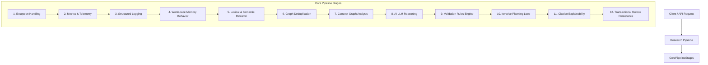

# Islamic Research Platform

An enterprise-grade, evidence-first research platform for Islamic primary sources. Designed with workflow rigor comparable to premium legal reference platforms like Westlaw and LexisNexis, this system helps scholars, students, and researchers ask complex theological and jurisprudential questions and receive thoroughly validated, cited, and auditable evidence dossiers.

> **Note on Philosophy:** The platform is **not** an AI Mufti. It does not issue religious fatwas or opinions. It is a structured knowledge discovery assistant that isolates primary source texts (the Quran, authentic Hadith, and classical Tafsir) from synthetic summaries, strictly maintaining scholarly validation constraints.

---

## Key Capabilities (Milestone 9)

- **Agentic Iterative Research Loops**: When reasoning gaps (such as weak citations or missing primary evidences) are detected, the pipeline automatically drafts target `RetrievalPlan` instances to search the corpus again, iteratively building up a complete answer until validation conditions are satisfied.
- **Explainable Composite Confidence**: Confidence scores are calculated using a pluggable, weighted calculator incorporating evidence verification (35%), citation authority (25%), rule validation (20%), model reasoning (15%), and methodology (5%). Breakdown analysis is logged in telemetry and returned with each query.
- **Workspace Knowledge Memory**: Supports persistent, decay-aware research memories. Past answers are compressed append-only and ranked dynamically using a Jaccard semantic matching engine, applying linear or exponential decay based on the specific workspace theme (e.g. Quranic memory is immune to decay).
- **Outbox-Driven Event Sourcing**: Inter-module consistency is maintained via a transactional database outbox engine. Notes revisions, exports, and memory invalidations are triggered asynchronously without blocking the core request execution.
- **Multi-Format Export Engine**: Asynchronous compile-export workers compile whole workspaces into Markdown, HTML, PDF, JSON, and DOCX formats.

---

## Architecture Overview

The system is constructed following strict **Clean Architecture** and Domain-Driven Design (DDD) principles:



- **Domain Layer (`Application/Research/Memory` & `Models`)**: Pure value objects, domain events (`ResearchExecutedEvent`), and contracts (`IKnowledgeMemoryStore`, `IIterationPlanner`).
- **Infrastructure Layer**: EF Core mapping onto PostgreSQL (`pgvector` support), local LLM integration clients, outbox background dispatchers, and file writers.
- **Presentation Layer (`WebApi/Controllers`)**: Versioned REST endpoints managing workspace scopes, continue queries, and export jobs.

---

## Getting Started

### Prerequisites
- .NET 8.0 SDK
- PostgreSQL database (configured for `pgvector` full-text indices)

### Running the Test Suite
We maintain a comprehensive suite of unit and integration tests covering loop convergence, confidence calculators, decay rankings, and full-text searches.

Run tests from the root directory:
```powershell
dotnet test backend/
```

### Core API Endpoints
- `POST /api/v1/workspaces/{id}/research` - Scopes research dossier generations to a workspace.
- `POST /api/v1/workspaces/{id}/continue` - Appends follow-up research questions reusing decay-aware workspace memory.
- `GET /api/v1/workspaces/{id}/memory` - Retrieves active knowledge memories associated with the workspace.
- `GET /api/v1/research/dossier?q=query` - Fetches hybrid search evidence graph.
