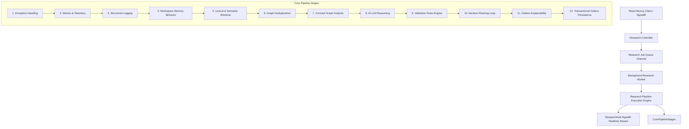

# Islamic Research Platform

An enterprise-grade, evidence-first research platform for Islamic primary sources. Designed with workflow rigor comparable to premium legal reference platforms like Westlaw and LexisNexis, this system helps scholars, students, and researchers ask complex theological and jurisprudential questions and receive thoroughly validated, cited, and auditable evidence dossiers.

> **Note on Philosophy:** The platform is **not** an AI Mufti. It does not issue religious fatwas or opinions. It is a structured knowledge discovery assistant that isolates primary source texts (the Quran, authentic Hadith, and classical Tafsir) from synthetic summaries, strictly maintaining scholarly validation constraints.

---

## Key Capabilities (Milestone 10: Research Execution Platform)

- **Persistent Research Sessions & Audit Trail**: Converts transient HTTP research into background execution jobs (`ResearchSessionStatus`: `Created`, `Queued`, `Running`, `Completed`, `Failed`, `Cancelled`). Granular lifecycle events (`ResearchSessionStartedEvent`, `ResearchSessionCompletedEvent`, `ResearchStageCompletedEvent`) are recorded with optimistic concurrency protection (`ConcurrencyToken`).
- **Background Worker & SignalR Streaming**: Long-running research execution runs in background channels (`ResearchBackgroundWorker`), streaming real-time stage progress (`Retrieval` $\rightarrow$ `Deduplication` $\rightarrow$ `Analysis` $\rightarrow$ `Reasoning` $\rightarrow$ `Validation` $\rightarrow$ `Explainability` $\rightarrow$ `Rendering`) to clients over SignalR WebSockets (`ResearchHub`).
- **Agentic Iterative Research Loops**: When reasoning gaps (such as weak citations or missing primary evidences) are detected, the pipeline automatically drafts target `RetrievalPlan` instances to search the corpus again, iteratively building up a complete answer until validation conditions are satisfied.
- **Explainable Composite Confidence**: Confidence scores are calculated using a pluggable, weighted calculator incorporating evidence verification (35%), citation authority (25%), rule validation (20%), model reasoning (15%), and methodology (5%). Breakdown analysis is logged in telemetry and returned with each query.
- **Workspace Knowledge Memory**: Supports persistent, decay-aware research memories. Past answers are compressed append-only and ranked dynamically using a Jaccard semantic matching engine, applying linear or exponential decay based on the specific workspace theme (e.g. Quranic memory is immune to decay).
- **Next.js React 19 Research Workspace UI**: Interactive frontend (`frontend/components/research/`) featuring live pipeline execution steps (`ResearchProgress.tsx`), confidence metrics breakdown (`ConfidenceMeter.tsx`), workspace memory inspection (`ResearchMemoryPanel.tsx`), and evidence provenance tracking.

---

## Architecture Overview

The system is constructed following strict **Clean Architecture** and Domain-Driven Design (DDD) principles:



- **Domain Layer (`Application/Research/Session` & `Memory`)**: Domain entities (`ResearchSession`, `ResearchIteration`, `ResearchEvent`, `ResearchResult`), domain events, and pure contracts.
- **Infrastructure Layer**: EF Core mappings onto PostgreSQL (`pgvector` support), background queue worker (`ResearchBackgroundWorker`), SignalR Hub (`ResearchHub`), and LLM provider implementations.
- **Presentation Layer (`WebApi/Controllers` & `frontend/`)**: REST endpoints for session lifecycle control and Next.js 16 / React 19 workspace UI.

---

## Getting Started

### Prerequisites
- .NET 8.0 SDK
- Node.js 20+ & pnpm / npm
- PostgreSQL database (configured for `pgvector` full-text indices)

### Running the Test Suite
We maintain a comprehensive suite of unit and integration tests covering research pipeline behaviors, background worker queues, loop convergence, and full-text searches.

Run tests from the root directory:
```powershell
dotnet test backend/
```

### Running the Next.js Frontend
```powershell
cd frontend
npm run dev
```

### Core API Endpoints
- `POST /api/research/sessions` - Creates and queues a new persistent research session job.
- `GET /api/research/sessions/{sessionId}` - Fetches current session status and progress.
- `GET /api/research/sessions/{sessionId}/result` - Retrieves final synthesized dossier and confidence scores.
- `POST /api/research/sessions/{sessionId}/cancel` - Cancels an active background research session.
- `GET /api/research/workspaces/{workspaceId}/memories` - Retrieves active knowledge memories associated with the workspace.
- SignalR WebSocket Endpoint: `http://localhost:5000/hubs/research`
